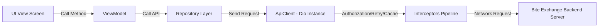
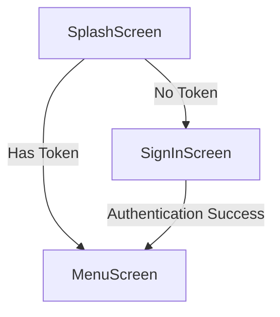

# Bite Exchange TV Menu Client (`Bite_Ex_Menu`)
## Technical Documentation & Architecture Reference

This documentation is designed to guide a new developer through the structure, architecture, workflows, and real-time implementations of the **Bite Exchange TV Menu Client** application.

---

## Table of Contents
1. [Project Overview & Core Architecture](#1-project-overview--core-architecture)
2. [Folder Structure & Project Organization](#2-folder-structure--project-organization)
3. [Login & Authentication Flow (QR Code Login)](#3-login--authentication-flow-qr-code-login)
4. [Complete API Flow & Networking Layer](#4-complete-api-flow--networking-layer)
5. [Home Screen & Menu Data Loading](#5-home-screen--menu-data-loading)
6. [Real-Time WebSocket Implementation (Pusher Protocol)](#6-real-time-websocket-implementation-pusher-protocol)
7. [State Management & Data Flow](#7-state-management--data-flow)
8. [Local Storage, Caching, & State Persistence](#8-local-storage-caching--state-persistence)
9. [Custom Features & Business Logic](#9-custom-features--business-logic)
10. [Navigation & Routing Flow](#10-navigation--routing-flow)
11. [Error Handling, Connectivity, & Performance Optimizations](#11-error-handling-connectivity--performance-optimizations)
12. [Security Implementations](#12-security-implementations)

---

## 1. Project Overview & Core Architecture

The **Bite Exchange TV Menu Client** is a specialized Flutter application built for **digital signage (TV Menu Boards)**. It operates in a dynamic "stock-exchange" styled restaurant/bar environment where menu prices fluctuate in real time depending on consumer demand, sales volume, and algorithmic rules. 

### Key Characteristics:
*   **Signage Target:** Designed to run on smart TVs (or TV-connected media players) positioned vertically (portrait mode).
*   **No User Interactivity (Normal Mode):** Once logged in, the client operates purely as a visual dashboard, reading configuration parameters and updating product prices, stock availability, and highlights automatically.
*   **MVVM Architecture:** Uses the Model-View-ViewModel (MVVM) structural pattern paired with the **Provider** state management library.
*   **Real-time Streaming:** Subscribes to backend price and market channels via WebSockets (Pusher protocol) to redraw UI elements dynamically with animation effects.

---

## 2. Folder Structure & Project Organization

The codebase is organized logically, separating components, routes, network requests, repositories, state managers, and views:

```
lib/
├── data/
│   └── network/
│       ├── api_client.dart          # Base HTTP client config (Dio, Interceptors, Retries)
│       └── dio_cache.dart           # Offline caching configurations (Hive Cache Store)
├── model/
│   └── menu_product_model.dart      # Product data models, category containers, and parsing
├── repository/
│   ├── auth_repository.dart         # Authentication APIs (Sign In, Create Session, Check Session)
│   └── menu_product_repository.dart # Menu item fetching APIs
├── res/
│   ├── components/                  # Global reusable UI widgets
│   │   ├── app_custom_flip_text.dart# Animated digit flip counters (price update animation)
│   │   ├── custom_app_button.dart   # Primary button with loading indicator support
│   │   ├── custom_text.dart         # Wrapper for GoogleFonts Inter implementation
│   │   ├── market_crashed_model.dart# Overlay for Market Crash event handling
│   │   └── not_found.dart           # Placeholder for empty data response states
│   ├── constants/
│   │   ├── app_colors.dart          # Colors palette definition & Hex color parser
│   │   ├── app_url.dart             # API base endpoints, WebSocket URLs, configuration keys
│   │   └── toast_message.dart       # Sweet Alert-style Cherry Toast wrapper
│   └── routes/
│       ├── routes.dart              # Custom page route generator logic
│       └── routes_name.dart         # App-wide routing path declarations
├── services/
│   ├── shared_pref_service.dart     # SharedPreferences local storage helper
│   ├── tv_wrapper.dart              # Custom layout builder scaling & 270° portrait TV rotation
│   └── web_socket_manager.dart      # Pusher protocol WS singleton (connect, event, ping, reconnect)
├── view/
│   ├── menu_view/
│   │   ├── components/
│   │   │   └── menu_header.dart     # Dynamic gradient header line separators for categories
│   │   └── menu_screen.dart         # Main grid/list dashboard rendering engine (dynamic sizes)
│   ├── sign_in_view/
│   │   └── sign_in_screen.dart      # QR code generated session login screen (polling loop)
│   └── splash_view/
│       └── splash_screen.dart       # Initial session check & logo scale entrance transition
├── main.dart                        # Multi-provider instantiation, material config, network checks
```

---

## 3. Login & Authentication Flow (QR Code Login)

Since typing email addresses and passwords on a smart TV remote is a bad user experience, this application leverages a **Session-based QR Code Authentication Flow**. 

### Step-by-Step Flow:
1.  **Session Creation:** On entering [SignInScreen](file:///Users/vivekshekhaliya/AndroidStudioProjects/Bite_Ex_Menu/lib/view/sign_in_view/sign_in_screen.dart), the application triggers a POST request to `/create-session` (implemented in [AuthRepository.createSession](file:///Users/vivekshekhaliya/AndroidStudioProjects/Bite_Ex_Menu/lib/repository/auth_repository.dart)).
2.  **QR Code Display:** The server responds with a unique `session_id`. The client forms a QR link:
    `https://site.biteexchange.com/qr-login?session=$sessionId` and displays it using `QrImageView`.
3.  **Polling Loop:** The screen spins up a 2-second interval periodic timer. This timer queries `/check-session?session=$sessionId` in the background (disabling cache layer explicitly via `noCache: true`).
    *   **Fallback / Timeout:** If the polling count exceeds `150` retries (5 minutes), the session is discarded, and the flow generates a new QR session ID automatically.
4.  **Mobile Authorization:** The restaurant manager scans the QR code using their authenticated mobile device and authorizes the TV terminal.
5.  **Session Validated:** The next polling request returns `{ "is_logged_in": true, "email": "...", "password": "...", "page_no": "..." }`.
6.  **Bearer Exchange:** The app cancels the polling timer, writes the assigned TV menu display page number (`page_no`) to the local storage, and fires `signInApi` within [AuthViewModel](file:///Users/vivekshekhaliya/AndroidStudioProjects/Bite_Ex_Menu/lib/view_model/auth_view_model.dart). This makes a POST to `/tv-login` returning the secure Bearer Token which gets persistent storage, and routes the application to the [MenuScreen](file:///Users/vivekshekhaliya/AndroidStudioProjects/Bite_Ex_Menu/lib/view/menu_view/menu_screen.dart).

### Sample API Responses (Authentication Flow)

#### 1. Create Session (`POST /create-session`)
```json
{
  "session_id": "8f8b5d3a-14d2-43f1-b8aa-63c6c06a32d1"
}
```

#### 2. Check Session (`GET /check-session?session=<session_id>`)
*   **Response when unauthorized / pending:**
    ```json
    {
      "is_logged_in": 0,
      "message": "Session is active, waiting for mobile authorization."
    }
    ```
*   **Response after mobile scan & approve:**
    ```json
    {
      "is_logged_in": 1,
      "email": "manager@biteexchange.com",
      "password": "secured_pass_credentials",
      "page_no": 1
    }
    ```

#### 3. TV Login Credentials Swap (`POST /tv-login`)
```json
{
  "success": true,
  "data": "eyJhbGciOiJIUzI1NiIsInR5cCI6IkpXVCJ9.ey...",
  "message": "Login successful"
}
```

---

## 4. Complete API Flow & Networking Layer

### Networking Engine: `ApiClient`
The application implements [ApiClient](file:///Users/vivekshekhaliya/AndroidStudioProjects/Bite_Ex_Menu/lib/data/network/api_client.dart), a wrapper around the **Dio** package. It configures the requests with:
*   `connectTimeout`, `receiveTimeout`, `sendTimeout` set to **15 seconds**.
*   `Accept` & `Content-Type` headers set to `application/json`.

### Interceptor Pipeline (Sequential Order):
1.  **`DioCacheInterceptor`:** Validates local caching options on incoming requests using `DioCache` (powered by the fast key-value storage engine `Hive`).
2.  **`InterceptorsWrapper` (Request authorization & session expiry):**
    *   **Request Interceptor:** Automatically queries `SharedPrefService` for a saved `'token'`. If found, adds the header: `Authorization: Bearer <token>`.
    *   **Response Error Interceptor:** Listens for HTTP `401 Unauthorized` or `403 Forbidden` response status codes. If triggered, it clears the stored credentials and token from local storage, forces the navigation stacks down, and pushes the user back to the `SignInScreen`.
3.  **`RetryInterceptor`:** Listens for network dropouts, connection failures, or timeouts. It automatically retries **only GET requests** up to **2 times** (delaying 2 seconds for the first attempt, and 4 seconds for the second attempt) before notifying the UI layer.
4.  **`PrettyDioLogger`:** Logs comprehensive request, header, payload body, and response logs during debugging.

### API Flow:


---

## 5. Home Screen & Menu Data Loading

The [MenuScreen](file:///Users/vivekshekhaliya/AndroidStudioProjects/Bite_Ex_Menu/lib/view/menu_view/menu_screen.dart) acts as the dynamic display dashboard.

### Initialization & Loading:
1.  **Reading Page Layout Configuration:** Reads the `'page'` key integer from local storage (tells the client whether it should draw items for Menu Screen Page 1, Page 2, etc.).
2.  **Executing API Call:** Invokes `MenuProductViewModel.getBannerApi(context, page: pageId)` which hits `/get-products-for-tv?page=pageId`.
3.  **Parser Mapping:** Decodes JSON payloads mapping them straight into the nested [MenuProduct](file:///Users/vivekshekhaliya/AndroidStudioProjects/Bite_Ex_Menu/lib/model/menu_product_model.dart) object structure containing a list of category blocks (`Datum`) which each hold a list of `Product` elements.
4.  **Setting Socket Listener:** Binds the screen callbacks (like the market crash event) to the ViewModel, and triggers `vm.startSocketListener()` to establish WebSocket sync.

### Sample API Response (Product Menu Loading)

#### Get Products for TV (`GET /get-products-for-tv?page=<page_no>`)
```json
{
  "success": true,
  "page": "1",
  "data": [
    {
      "id": 1,
      "name": "Draught Beer & Spirits",
      "products": [
        {
          "id": 101,
          "name": "Kingfisher Premium",
          "price": "220.00",
          "menu_price": "180.00",
          "price_color": "green",
          "image": "https://site.biteexchange.com/storage/products/kf_premium.png",
          "category_id": 1,
          "is_available": 1,
          "stock": "45",
          "highlight_product": false
        },
        {
          "id": 102,
          "name": "Budweiser Magnum",
          "price": "310.00",
          "menu_price": "310.00",
          "price_color": "gray",
          "image": "https://site.biteexchange.com/storage/products/bud_magnum.png",
          "category_id": 1,
          "is_available": 1,
          "stock": "0",
          "highlight_product": true
        }
      ]
    }
  ],
  "message": "TV products list loaded successfully."
}
```

---

## 6. Real-Time WebSocket Implementation (Pusher Protocol)

Real-time price changes and events are managed by the [WebSocketManager](file:///Users/vivekshekhaliya/AndroidStudioProjects/Bite_Ex_Menu/lib/services/web_socket_manager.dart) singleton, which uses `web_socket_channel` to interact with Pusher-styled backend events.

### Lifecycle of the Connection:
*   **Establishment:** During initial loading, `WebSocketManager().connect(AppUrl.socketUrl)` is called.
*   **Keep-Alive Handling:** Listens for `"pusher:ping"` payload packets from the WebSocket server and automatically replies with a `"pusher:pong"` packet to prevent timeouts.
*   **Reconnection Logic:** If the socket emits an error or is closed (`onDone`), the manager changes `_isConnected = false` and schedules a reconnection task after a **5-second delay** recursively until connection recovery.

### Custom Event Handling & UI Parsing:
The manager decodes incoming string events and filters payloads by event keys. Below are the actual JSON message structures received from the WebSocket:

1.  **`pusher:connection_established`**
    *   **Action:** Server confirms socket handshakes. The client automatically subscribes to `"price-channel"` and `"market-crash-channel"`.
    *   **Sample Event JSON:**
        ```json
        {
          "event": "pusher:connection_established",
          "data": "{\"socket_id\":\"425983.8423910\",\"activity_timeout\":120}"
        }
        ```

2.  **`price.updated`**
    *   **Action:** Maps variables, transforms them into a clean internal payload format, and updates properties within the corresponding product list memory node, triggering UI redraws.
    *   **Sample Event JSON:**
        ```json
        {
          "event": "price.updated",
          "data": "{\"price\":{\"product_id\":101,\"new_price\":\"225.00\",\"menu_price\":\"180.00\",\"stock\":\"42\",\"price_color\":\"green\",\"highlight_product\":false}}"
        }
        ```

3.  **`highlight.updated`**
    *   **Action:** Toggles background/border highlights for a specific item to draw customer attention.
    *   **Sample Event JSON:**
        ```json
        {
          "event": "highlight.updated",
          "data": "{\"highlight\":{\"product_id\":101,\"highlight_product\":true}}"
        }
        ```

4.  **`market.crash` or `.market.crash`**
    *   **Action:** Emits a `market_crashed` message. If not currently active, the ViewModel triggers the `onMarketCrashed` visual callback, playing a bell sound, showing confetti, and auto-dismissing.
    *   **Sample Event JSON:**
        ```json
        {
          "event": "market.crash",
          "data": "{\"crashed_at\":\"2026-08-08T14:20:00Z\",\"message\":\"Market hit peak index! All prices reset.\"}"
        }
        ```

5.  **`pusher:ping`**
    *   **Action:** WebSocket keep-alive handshake message. The client automatically replies with a `pusher:pong` payload.
    *   **Sample Event JSON:**
        ```json
        {
          "event": "pusher:ping",
          "data": {}
        }
        ```

---

## 7. State Management & Data Flow

The project leverages [Provider](file:///Users/vivekshekhaliya/AndroidStudioProjects/Bite_Ex_Menu/pubspec.yaml) for reactive rendering of variables.

### Active ViewModels:
1.  **`AuthViewModel`:** Manages sign-in request states, tracks loading flags, coordinates user authentication token storage, and controls page replacement routes on success.
2.  **`MenuProductViewModel`:**
    *   Holds the current memory reference of [MenuProduct](file:///Users/vivekshekhaliya/AndroidStudioProjects/Bite_Ex_Menu/lib/model/menu_product_model.dart).
    *   Subscribes to the broadcast stream output from `WebSocketManager`.
    *   Updates specific nested elements in-memory inside the categories structure when receiving price/highlight updates, then triggers `notifyListeners()` to rebuild targeted widgets.

### Complete Data Flow Diagram:
```
  [ WebSocket Event ]              [ REST API Payload ]
          │                                  │
          ▼                                  ▼
[ WebSocketManager ]                  [ Auth/Menu Repo ]
  (Broadcast Stream)                         │
          │                                  ▼
          └─────────────► [ ViewModel ] ◄────┘
                         (ChangeNotifier)
                                │ (notifyListeners)
                                ▼
                           [ UI Screens ]
                       (Rebuild Target Widgets)
```

---

## 8. Local Storage, Caching, & State Persistence

### Key-Value Storage: `SharedPrefService`
Features a standard helper around the `shared_preferences` package, serializing complex Maps or lists to JSON strings automatically.
*   **Stored keys:**
    *   `'token'`: Bearer token used to authenticate GET/POST API endpoints.
    *   `'page'`: Target layout page configuration identifier (e.g. `1` or `2`).
    *   `'user'`: Optional cached user session profiles.

### API Response Caching: `DioCache`
Uses `http_cache_hive_store` along with `path_provider` to build a local cache system.
*   **Cache Store:** A custom `HiveCacheStore` created in the app's temporary folder directory on the TV platform.
*   **Caching Policy:** Defaults to `CachePolicy.noCache` globally, but allows fine-grained configurations by setting `'noCache': true` or custom headers on specific endpoints (like session checks).

---

## 9. Custom Features & Business Logic

The TV menu board features several custom UI states that respond to real-time events:

### A. Layout Orientation Rotation (`TvWrapper`)
To display a portrait layout on a landscape mounted TV, the [TvWrapper](file:///Users/vivekshekhaliya/AndroidStudioProjects/Bite_Ex_Menu/lib/services/tv_wrapper.dart) wraps the `MaterialApp`:
*   Forces screen viewport boundaries to exactly **1920x1080** via `FittedBox(fit: BoxFit.cover)`.
*   Uses `RotatedBox(quarterTurns: 3)` to rotate the render output by **270 degrees** to run vertically.
*   Internal dimensions inside the wrapper are defined as **1080x1920** (portrait aspect ratio).

### B. Price Update Animation (`AppCustomFlipText`)
Every price change triggers an odometer-styled numerical rolling transition. Powered by `AnimatedFlipCounter`, it updates prices smoothly without jarring text changes.

### C. Out-of-Stock Filter (`ColorFiltered`)
When a product's stock drops to `'0'`:
*   The system wraps the product grid cell in a `ColorFiltered` widget using a custom color matrix to convert the image and text to grayscale.
*   It displays a white `"NA"` (Not Available) badge at the top-right corner.
*   The container opacity is set to `0.37` to indicate it is unavailable.

### D. Real-Time Price Direction Indicators
The menu compares the product's real-time price against the baseline `menuPrice`.
*   If the price increases, it shows a **`+ ₹Diff`** with an upward-pointing arrow.
*   If the price decreases, it shows a **`- ₹Diff`** with a downward-pointing arrow (achieved by rotating `direction_icon.svg` by 180 degrees using `RotatedBox`).
*   The arrow and price text automatically change color (e.g. green for drops, red for increases) using `AppColors.parsePriceColor`.

### E. Product Highlights
If a product's `highlightProduct` is set to `true` (via API or WebSocket update), the app highlights the item with a crimson red border and background overlay to draw customer attention.

---

## 10. Navigation & Routing Flow

App routes are organized under a centralized class [Routes](file:///Users/vivekshekhaliya/AndroidStudioProjects/Bite_Ex_Menu/lib/res/routes/routes.dart).



*   **`RoutesName.splash` ("splash_screen"):** Triggers when the app starts. Displays a scaled logo animation and checks the login token before navigating.
*   **`RoutesName.signInScreen` ("sign_in_screen"):** Shows the login QR code. Uses polling to check status.
*   **`RoutesName.menuScreenOne` ("menu_screen_one"):** Renders the digital menu board with real-time price updates.

---

## 11. Error Handling, Connectivity, & Performance Optimizations

### A. Connectivity Monitor
The entry widget in [main.dart](file:///Users/vivekshekhaliya/AndroidStudioProjects/Bite_Ex_Menu/lib/main.dart) uses `connectivity_plus` to listen for network state changes:
*   If the connection drops (`ConnectivityResult.none`) and the app cannot reach `'google.com'`, it displays a modal block warning: `"No Internet connection found"`.
*   The dialog automatically dismisses when the internet connection is restored.

### B. SSL Certificate Override (`MyHttpOverrides`)
Because Android TVs frequently encounter network issues, SSL handshake failures, or certificate expiration errors in private local networks, the app uses a custom `HttpOverrides` class:
```dart
class MyHttpOverrides extends HttpOverrides {
  @override
  HttpClient createHttpClient(SecurityContext? context) {
    return super.createHttpClient(context)
      ..badCertificateCallback = (X509Certificate cert, String host, int port) => true;
  }
}
```
This bypasses SSL verification issues during development and deployment on local networks.

---

## 12. Security Implementations

*   **Secure API Requests:** Every HTTP request to the API backend is secured using a **JSON Web Token (JWT) Bearer Authentication** scheme added to request headers.
*   **Secure Storage:** Authentication tokens are stored locally via `SharedPreferences`.
*   **Automatic Logout:** The HTTP client interceptor checks for `401 Unauthorized` and `403 Forbidden` response statuses. It automatically clears credentials and routes the app back to the sign-in screen if session token validation fails.
